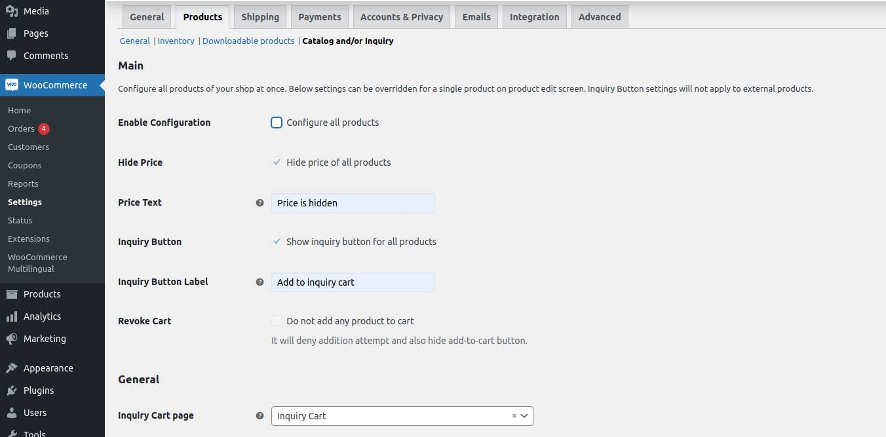
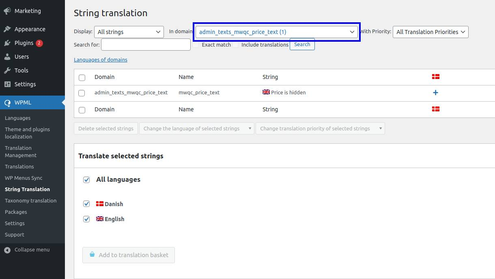
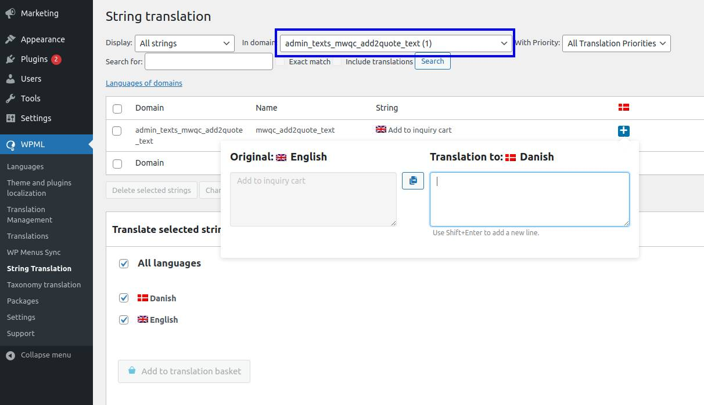
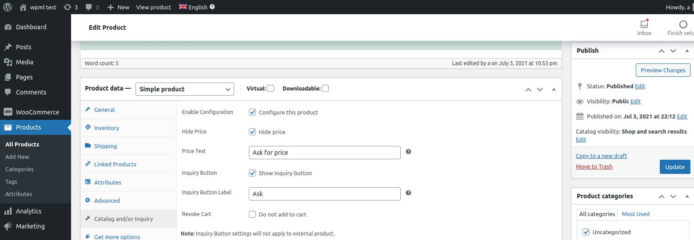
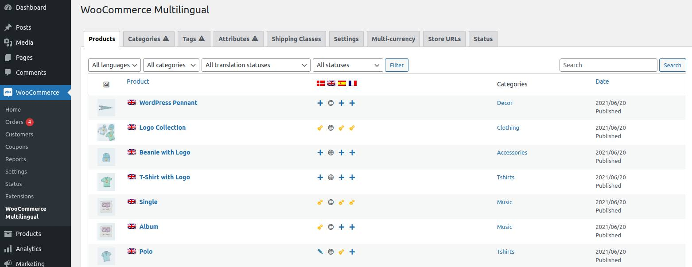
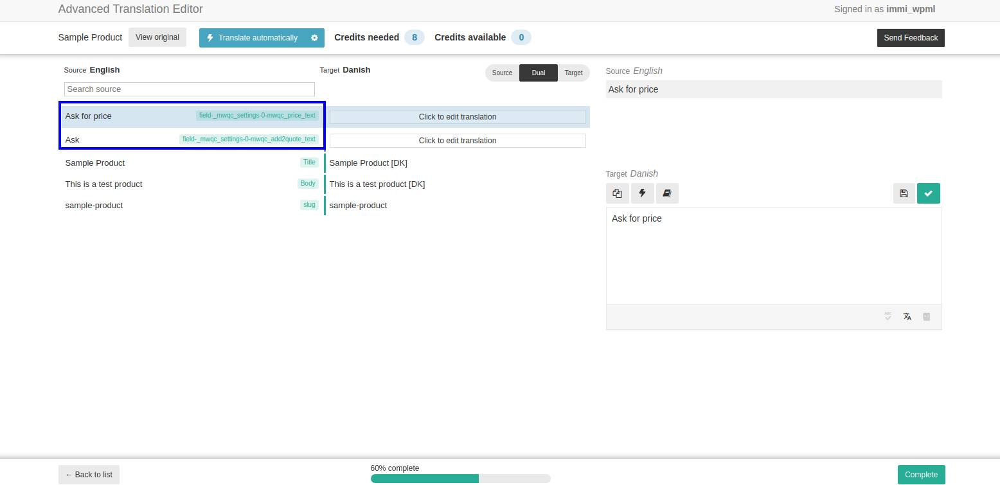
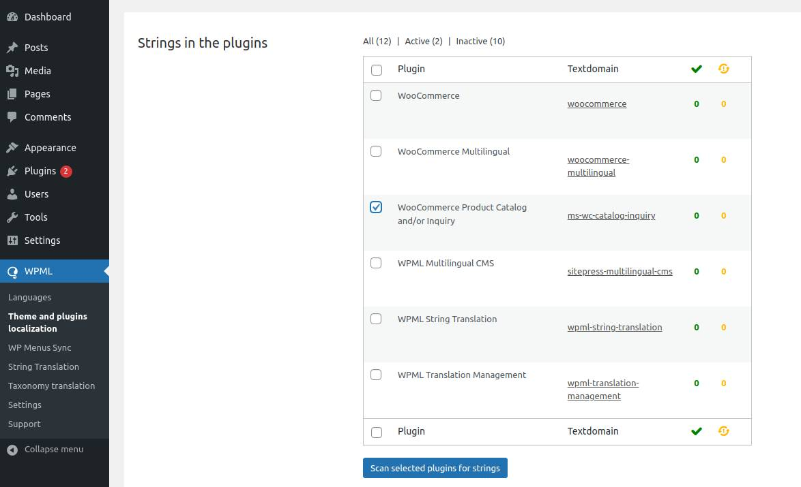
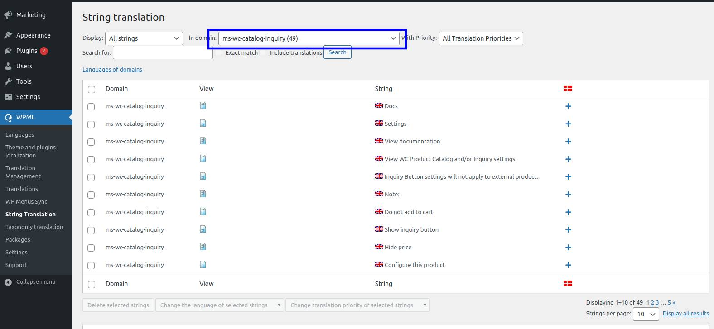

## Introduction
WooCommerce Product Catalog and/or Inquiry is a multi-purpose plugin to let you set all or selected products in catalog mode by revoking cart and optionally hiding product price. It also lets you receive inquiry for any product regardless of its catalog mode status by adding an inquiry cart to your store and showing inquiry button for the product. What you call this inquiry (order, request a quote, info query) and which form (Contact Form 7, Gravity Forms, etc.) you use to receive this inquiry is up to you. You can receive inquiry cart's content in the email sent to you by the inquiry form. You can also customize product price text and inquiry button label.

### Features
- For all or selected products
  - Enable catalog mode
  - Receive inquiry from registered or guest user
  - Hide price and/or customize price text
  - Revoke cart (deny add-to-cart request and hide add-to-cart button)
  - Show inquiry button and/or customize button label
- Global and Product level settings
    - Override global settings at product level or just configure at product level
- Inquiry Cart Page
  - Use auto-created inquiry cart page or create a new one
  - Add inquiry cart to a page using shortcode - *[mwqc_cart]*
  - Add inquiry form to inquiry cart page using shortcode
- Inquiry Form
  - Use any shortcode-rendered form (Contact Form 7, Gravity Forms, etc.) as inquiry form [Details](#inquiry-form "Read more about inquiry form")
  - Add inquiry cart contents in the email template of the inquiry form using shortcode - *[mwqc_cart_4_email]*
  - Hide inquiry form for empty inquiry cart by wrapping it in *[mwqc_if_non_empty_cart]* shortcode
- Inquiry Button Behavior
  - If simple product is added to shopping cart via AJAX on shop page, it will also be added to inquiry cart via AJAX on shop page
  - if user is redirected to shopping cart after add-to-cart, they will also be redirected to inquiry cart after add-to-inquiry
- Allows shopping cart and checkout with orginal price for non-catalog-mode product
- Prevents the inferring of the price of a hidden-priced-product by hiding the prices in the inquiry cart's total section

## Installation

### Minimum Requirements

- PHP 7 or greater is recommended
- Wordpress 5.0 or greater
- Woocommerce 4.1 or greater

### Manual installation

Manual installation method requires downloading this plugin and uploading it to your web server via your favorite FTP application. The WordPress codex contains [instructions on how to do this here](https://wordpress.org/support/article/managing-plugins/#manual-plugin-installation).

### Updating

Plugin will automatically check for new version and show update notification in Wordpress dashboard with one-click upgrade link.

## Configuration

Plugin let you configure itself at multiple levels. Each level covers a particular set of products. A lower level covers a subset of the products being covered by the level on top of it. These levels are:
- Global
- Prodouct Category
- Product

**Please note**, only Global and Product levels are available as of now (version 1.0.0).

This level based settings make it possible to configure a set of products at a certain level and then override this configuration for a subset of products at a lower level. For example, you can hide price of all products at Global level and show price of selected products by configuring them at Product level.

### Global Level
- Open "WooCommerce Settings" page in Dashboard (Dashboard -> WooCommerce -> Settings).
- Switch to "Products" tab and then open "Catalog and/or Inquiry" sub-tab.

### Product Level
- Open "Product Edit" page in Dashboard (Dashboard -> Products).
- Open the product you want to edit from the product list.
- Scroll down to data panels and open "Catalog and/or Inquiry" data panel.

## Usage
- **Configure for all products**
  - Open "WooCommerce Settings" page in back-end, switch to "Product" tab and then switch to "Catalog and/or Inquiry" sub-tab.
  - Enable "Configure all products" and based on your requirements for front-end:
    - Enable "Hide Price" to hide price of all products.
    - Optionally, set custom text in "Price Text" to show as price.
    - Enable "Inquiry Button" to show inquiry button for all products.
    - Optionally, set custom text in "Inquiry Button Label" to show as inquiry button label. Default label is "Add to inquiry".
    - Enable "Revoke Cart" to deny add-to-cart request and hide "Add to cart" button.

- **Configure individual product or override global settings for that product**
  - Open "Product Edit" page in back-end, scroll down to data panels and then switch to "Catalog and/or Inquiry" data panel.
  - Same settings as at global level.

**Note**, External products can not be added to inquiry cart. That's why both global and product level "Inquiry Button" settings will be ignored for them.

- **Add inquiry form to inquiry cart page**
  - Create form with any form plugin (Contact Form 7, Gravity Forms, etc.)
  - See form plugin's documentation to know the shortcode to render the form.
  - Edit inquiry cart page in back-end.
  - Add the form shortcode while wrapping it in [mwqc_if_non_empty_cart] shortcode.
    - Example: [mwqc_if_non_empty_cart][contact-form-7 id="58"][/mwqc_if_non_empty_cart]
    - Explanation: [contact-form-7 id="58"] shortcode renders the inquiry form. [mwqc_if_non_empty_cart] shortcode hides the inquiry form for empty inquiry cart.
    - Wrapping form shortcode is optional. If not wrapped, your inquiry form will remain visible on inquiry cart page when inquiry cart is empty.
  - Save the inquiry cart page.

- **Receive inquiry cart's contents in the email sent to you by the inquiry form on form submission**
  - Open inquiry form. 
  - Add *[mwqc_cart_4_email]* shortcode in its email template.
  - Save the form.

- **Replace auto-created inquiry cart page**
  - Add *[mwqc_cart]* shortcode to new page.
  - Go to global settings as described above and select this new page in "Inquiry Cart Page" dropdown.

## Inquiry Form
Any  shortcode-rendered form can be used as inquiry form given that it sends email to you on form submission.
If you want to receive inquiry cart's content in this email, you will need to add *[mwqc_cart_4_email]* shortcode in its email template. To add this shortcode, the inquiry form should support customization of email template and interpretation of shortcode available in the email template.
All popular WordPress Form plugins send email on form submission. If any Form plugin doesn't directly let you customize email template or interpret shortcode, I shall make it work for my plugin. Please let me know! I have already done it for Contact Form 7.
Contact Form 7 does not interpret shortcode added to its email template. It has its own mail-tags which look like shortcode. My plugin has necessary code to get my *[mwqc_cart_4_email]* shortcode interpreted by Contact  Form 7.

## Localization
WooCommerce Product Catalog and/or Inquiry plugin is localization ready and compatible with WPML.

### WPML
This section describes how to translate WooCommerce Product Catalog and/or Inquiry plugin in WPML.

#### Prerequisite
- Install and configure [Woocommerce Multilingual](https://wpml.org/documentation/related-projects/woocommerce-multilingual/).
- Install and optionally configure WooCommerce Product Catalog and/or Inquiry.

#### Localize Global Level Settings
1. Open "Catalog and/or Inquiry" sub-tab of Product tab on WooCommerce Settings page [Read how to open it](#global-level "Read more about how to open global settings").
2. Make sure, "Price Text" and "Inquiry Button Label" fields are not blank.
   - WPML doesn't allow translating empty fields.
   - It doesn't matter whether you leave "Enable Configuration" checked or unchecked.

3. Open "String Translation" page in Dashboard (Dashboard -> WPML -> String Translation).
4. Select "admin_texts_mwqc_price_text" from "domain" dropdown to translate "Price Text".

4. Select "admin_texts_mwqc_add2quote_text" from "domain" dropdown to translate "Inquiry Button Label".

#### Localize Product Level Settings
1. Open "Catalog and/or Inquiry" data panel on product edit screen [Read how to open it](#product-level "Read more about how to open product settings")
2. Make sure, "Price Text" and "Inquiry Button Label" fields are not blank.
   - WPML doesn't allow translating empty fields.
   - It doesn't matter whether you leave "Enable Configuration" checked or unchecked.

3. Open "WooCommerce Multilingual" page in Dashboard (Dashboard -> WooCommerce -> WooCommerce Multilingual).
4. Make sure you are on Products tab.
5. Add/Edit the translation by clicking the icons in the column showing the country flags.

6. WPML will open either Advanced Translation Editor or Classic Translation Editor.
7. Translate "Price Text" and "Inquiry Button Label" fields.

#### Troubleshoot
- If "Price Text" and "Inquiry Button Label" fields are not blank and Advanced Translation Editor doesn't show them, resave the product (edit it and click update - it is not necessary to change any thing).
- if above step doesn't work, open WPML settings page and make sure "_mwqc_settings" field is set to "Translate" under "Custom Fields" section. See [Translating Custom Fields](https://wpml.org/documentation/getting-started-guide/translating-custom-fields/) in WMPL documentation for more info.

#### Localize Messages
WooCommerce Product Catalog and/or Inquiry plugin shows messages in response to user actions. For example, when user updates the inquiry cart, "Inquiry Cart updated." message is shown. You can translate these messages too.
1. Open "Theme and plugins localization" page (Dashboard -> WPML -> Theme and plugins localization).
2. Scroll down to "Strings in the plugins" section.
3. Select "WooCommerce Product Catalog and/or Inquiry" from the list.
4. Click "Scan selected plugins for strings" button at the bottom of the list.

5. After scan is completed, open "String Translation" page in Dashboard (Dashboard -> WPML -> String Translation).
6. Select "ms-wc-catalog-inquiry" domain from "in domain" dropdown.
7. WPML will list only the strings of WooCommerce Product Catalog and/or Inquiry plugin.
8. Translate.

**Note:** After the scan, WPML will show you two domains - ms-wc-catalog-inquiry and woocommerce - next to "WooCommerce Product Catalog and/or Inquiry" in "Strings in the plugins" section. You don't need to translate the string in woocommerce domain because their translation will be provided by the WooCommerce. WPML shows them here because they are being used in "WooCommerce Product Catalog and/or Inquiry" plugin.
## FAQS
- **How to hide inquiry form when inquiry cart is empty?**  
Enclose your form's shortcode in my *[mwqc_if_non_empty_cart]* shortcode.  
Example: ***[mwqc_if_non_empty_cart]***[contact-form-7 id="58"]***[/mwqc_if_non_empty_cart]***

- **How do you prevent inference of hidden-priced product's price from the inquiry cart totals?**  
By replacing prices in the totals section with the price (replacement) text set in backend for that hidden-priced product.

- **If inquiry cart has multiple hidden-priced products, which product's price text is used in the inquiry cart totals?**  
The text of the first hidden-priced product that was added to the inquiry cart.

- **Is output of *[mwqc_cart_4_email]* shortcode plain text or HTML?**  
It is HTML. If inquiry form is made in Contact Form 7, you will need to mark the " Use HTML content type" checkbox on the mail tab on the form edit screen in backend. Gravity Forms by default sends HTML email.

- **Are product prices hidden/visible in the output of *[mwqc_cart_4_email]* shortcode?**  
This output is a trimmed version of the inquiry cart. If a product price is hidden in the inquiry cart, it will also be hidden in the output of this shortcode. Please note, currently inquiry cart's total and tax are not available in this output.
